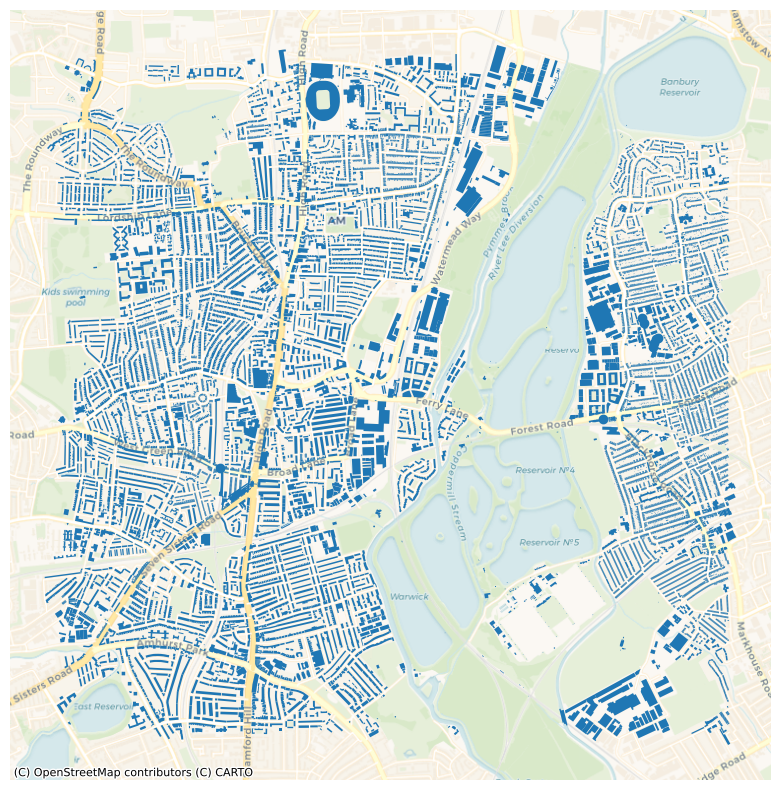
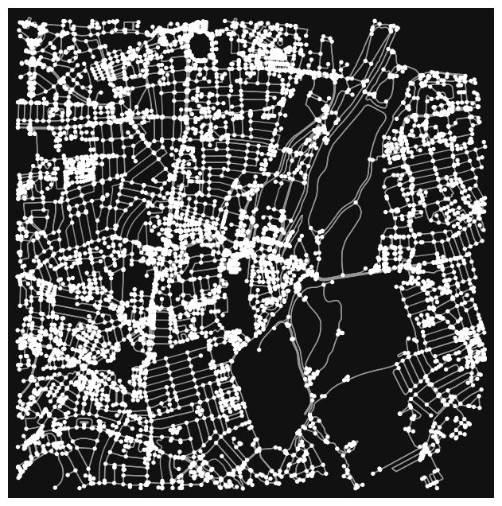
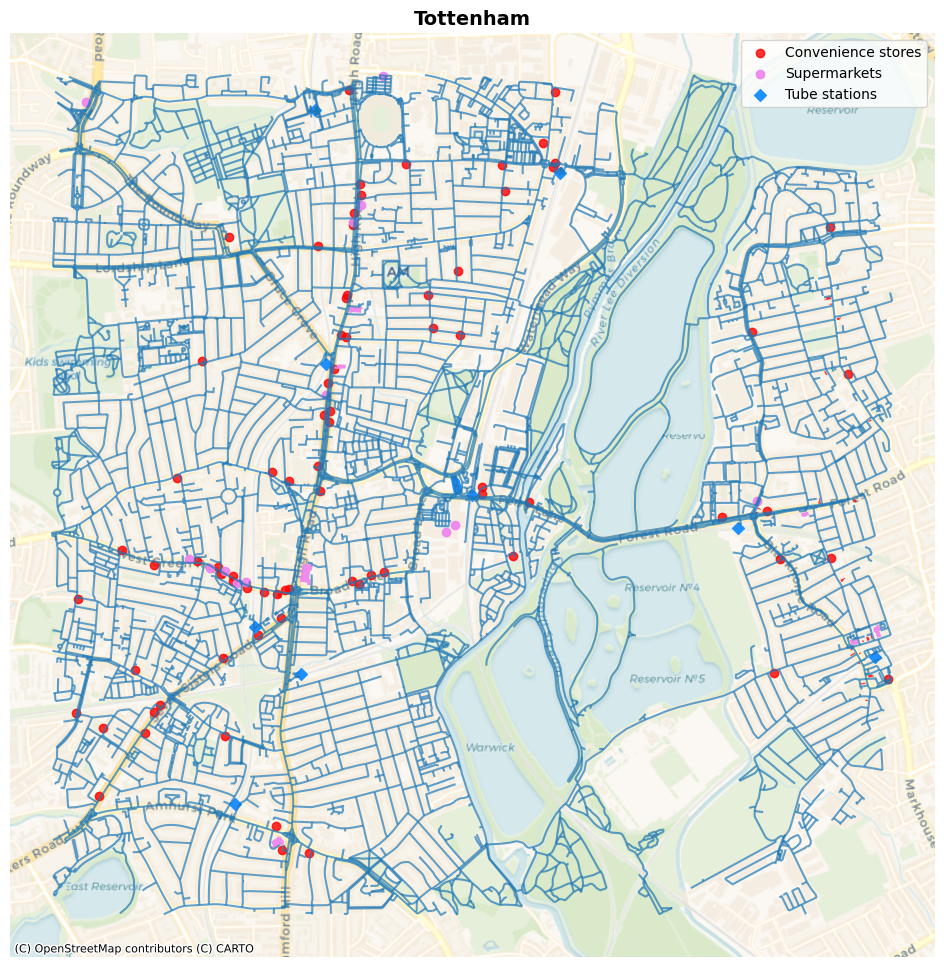
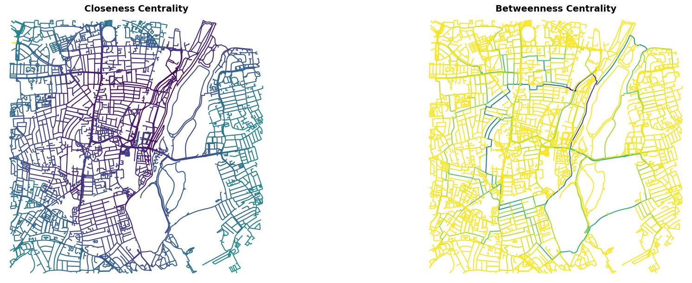
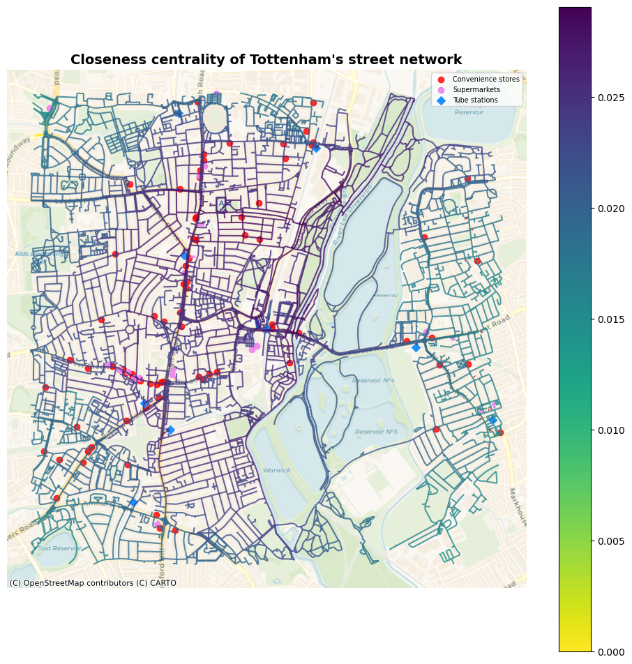
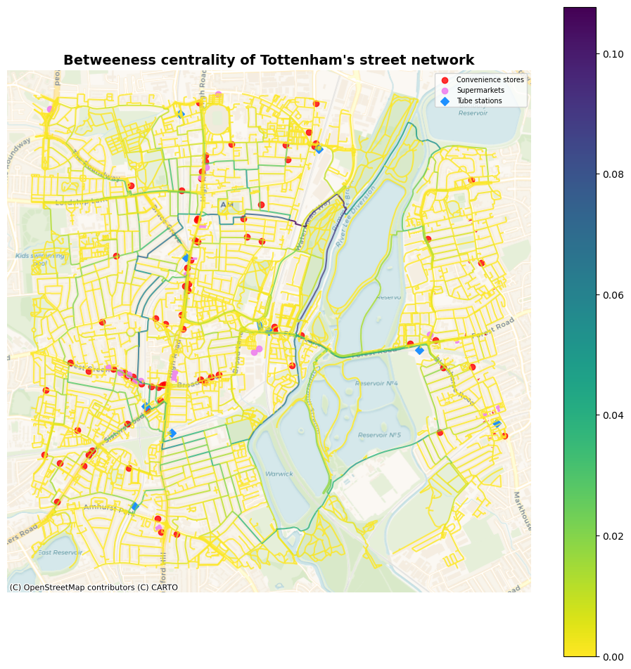

 # <center>Wandering around Tottenham Hale

Why are supermarkets and convenience stores in Tottenham situated where they are? This report examines if street connectivity, using closeness and betweenness centrality measures, influences the location of supermarkets and conveniences stores.

## Libraries
For the study the following libraries were used:


```python
import numpy as np
import pandas as pd
import matplotlib
import matplotlib.pyplot as plt
import osmnx as ox
import networkx as nx
import matplotlib.cm as cm
import matplotlib.colors as colors
import contextily as ctx
import sys
```

## Data description
The analysis focuses on the district of Tottenham, located in the northern part of London within the borough of Haringey. The central point of the study area is Tottenham Hale station, with a buffer zone of 2 km applied around it.

Data for this analysis was extracted using the OSMnx library from OpenStreetMap. As shown on the map, the neighborhood features the River Lea, which serves as a natural boundary separating Tottenham from Walthamstow, where the Walthamstow Wetlands are located.

Key landmarks include the Tottenham Hotspur football stadium, situated to the north along the High Road. Tottenham's main tube station is Tottenham Hale, which provides access to the Victoria line. Additionally, nearby stations include Seven Sisters and Blackhorse Road, both of which also connect to the Victoria line and Overground services. Other nearby stations include South Tottenham, Stamford Hill, and St. James Street, all of which are connected to the Overground system.


```python
# Get features from OSM near Tottenham Hale, London (2km radius)
all_geom = ox.features_from_address('Tottenham, London',tags = {'building': True}, dist=2000)
all_geom = all_geom.to_crs(epsg=3857) #Projecting the crs to mercator
fig,ax = plt.subplots(figsize=(10,10))
all_geom.plot(ax=ax,)
import contextily as ctx
ctx.add_basemap(ax,source=ctx.providers.CartoDB.Voyager,zoom_adjust=0)
plt.axis('off')
plt.show()
```


    

    


## Analysis
For the analysis, the Tottenham neighbourhood was extracted and transform to a network with nodes and edges using the library osmnx with a buffer zone of 2 km.


```python
#The extraction of the walk network for Tottenham Hale
tottenham=ox.graph_from_address('Tottenham,London',network_type='all_public', dist=2000)
ox.plot_graph(tottenham)
```


    

    


    (<Figure size 800x800 with 1 Axes>, <Axes: >)


The analysis for the report will focus on supermarkets and convenience stores sourced from OpenStreetMaps. To enhance the analysis, tube stations will also be included. In Tottenham, notable store chains such as Lidl, Tesco, Asda, and Iceland are located within this area.


```python
tags = {'shop': ['convenience', 'supermarket'], #filters for land use
    'public_transport': 'station'} #underground/overground stations
tottenham_geom = ox.features_from_address('Tottenham, London', tags, dist=2000)
tottenham_geom = tottenham_geom.to_crs(epsg=3857)

# convert network to geopandas dataframe for plotting the map
tottenham_edges = ox.graph_to_gdfs(tottenham,nodes=False,fill_edge_geometry=True)
tottenham_edges = tottenham_edges.to_crs(epsg=3857)
```


```python
# map of tottenham with supermarkets, walk network and tube stations
fig, ax = plt.subplots(figsize=(12, 12))
# plotting the edges of the walk network
tottenham_edges.plot(ax=ax, alpha=0.7)

tottenham_geom[tottenham_geom['shop']=='convenience'].plot(ax=ax, color='red', alpha=0.8, label="Convenience stores")
tottenham_geom[tottenham_geom['shop']=='supermarket'].plot(ax=ax, color='violet', alpha=0.9, label='Supermarkets')
tottenham_geom[tottenham_geom['public_transport'].notna()].plot(ax=ax, color='dodgerblue', alpha=1, marker='D', label="Tube stations")

# basemap
ctx.add_basemap(ax, source=ctx.providers.CartoDB.Voyager)

ax.set_title("Tottenham", fontsize=14, weight='bold')
ax.legend(loc="upper right", fontsize=10)
ax.set_axis_off()

# Show the plot
plt.show()
```

    C:\Users\krist\AppData\Local\Temp\ipykernel_19800\4069590884.py:14: UserWarning: Legend does not support handles for PatchCollection instances.
    See: https://matplotlib.org/stable/tutorials/intermediate/legend_guide.html#implementing-a-custom-legend-handler
      ax.legend(loc="upper right", fontsize=10)
    


    

    


```python
#transform the network to a directional graph
tott_DG = ox.convert.to_digraph(tottenham)
```

### Closeness centrality
Closeness centrality measures the average shortest distance between each node in a network. Nodes with high closeness centrality are important because they can easily connect to other nodes throughout the network. Identifying these nodes is crucial for understanding whether arterial streets influence the location of stores.


```python
# closeness centrality
edge_cc = nx.closeness_centrality(nx.line_graph(tott_DG))
nx.set_edge_attributes(tott_DG, edge_cc,'cc')
```

### Betweeness centrality
Betweenness centrality measures how frequently a node appears on the shortest path between all pairs of nodes in a network. In this analysis, it is important to examine whether streets that serve as significant intermediaries influence the location of supermarkets, either by attracting customers or by providing better accessibility for supply deliveries.


```python
# betweeness centrality
edge_bc = nx.betweenness_centrality(nx.line_graph(tott_DG))
nx.set_edge_attributes(tott_DG, edge_bc,'bc') #to incorporate the measure into the network as an attribute
```


```python
#multigraph network
tott_mg = nx.MultiGraph(tott_DG)
```


```python
# color the nodes in the original graph with their degree centralities 
cc = ox.plot.get_edge_colors_by_attr(tott_mg, 'cc', cmap='viridis_r')
bc = ox.plot.get_edge_colors_by_attr(tott_mg, 'bc', cmap='viridis_r')
```

### Maps


```python
#Subplots
fig, axes = plt.subplots(1, 2, figsize=(18, 6), constrained_layout=True)
titles = ["Closeness Centrality", "Betweenness Centrality"]
for ax, color, title in zip(axes, [cc, bc], titles):
    ox.plot_graph(tott_mg,
                  node_size=0, node_color='w', node_edgecolor='gray', node_zorder=2,
                        edge_color=color, edge_linewidth=1.5, edge_alpha=1,ax=ax, 
                  bgcolor='white', 
                  show=False)

    ax.set_title(title, fontsize=14, fontweight='bold')
plt.show()
```


    

    


```python
tottenham_edges = ox.graph_to_gdfs(tott_mg,nodes=False,fill_edge_geometry=True)
tottenham_edges = tottenham_edges.to_crs(epsg=3857)
```

The closeness map reveals that High Road has one of the highest closeness degrees, indicating its significant proximity to all other streets and emphasizing its importance in Tottenham.


```python
# closeness map
fig, ax = plt.subplots(figsize=(12, 12))
tottenham_edges.plot('cc',cmap='viridis_r',ax=ax, legend=True, alpha=0.8)
tottenham_geom[tottenham_geom['shop']=='convenience'].plot(ax=ax, color='red', alpha=0.8, label="Convenience stores")
tottenham_geom[tottenham_geom['shop']=='supermarket'].plot(ax=ax, color='violet', alpha=0.9, label='Supermarkets')
tottenham_geom[tottenham_geom['public_transport'].notna()].plot(ax=ax, color='dodgerblue', alpha=1, marker='D', label="Tube stations")

# basemap
ctx.add_basemap(ax, source=ctx.providers.CartoDB.Voyager)

ax.set_title("Closeness centrality of Tottenham's street network", fontsize=14, weight='bold')
ax.legend(loc="upper right", fontsize=7)
ax.set_axis_off()
plt.show()
```

    C:\Users\krist\AppData\Local\Temp\ipykernel_19800\498656362.py:12: UserWarning: Legend does not support handles for PatchCollection instances.
    See: https://matplotlib.org/stable/tutorials/intermediate/legend_guide.html#implementing-a-custom-legend-handler
      ax.legend(loc="upper right", fontsize=7)
    


    

    


The betweenness map shows that streets with the highest degree are primarily located near the River Lea and around the Walthamstow Wetlands. This highlights the streets that serve as connections between Tottenham and Walthamstow. Other streets with high degree centrality are found in the center, near the High Road. 


```python
# betweeness map
fig, ax = plt.subplots(figsize=(12, 12))
tottenham_edges.plot('bc',cmap='viridis_r',ax=ax, legend=True, alpha=0.8)
tottenham_geom[tottenham_geom['shop']=='convenience'].plot(ax=ax, color='red', alpha=0.8, label="Convenience stores")
tottenham_geom[tottenham_geom['shop']=='supermarket'].plot(ax=ax, color='violet', alpha=0.9, label='Supermarkets')
tottenham_geom[tottenham_geom['public_transport'].notna()].plot(ax=ax, color='dodgerblue', alpha=1, marker='D', label="Tube stations")

# basemap
ctx.add_basemap(ax, source=ctx.providers.CartoDB.Voyager)

ax.set_title("Betweeness centrality of Tottenham's street network", fontsize=14, weight='bold')
ax.legend(loc="upper right", fontsize=7)
ax.set_axis_off()
plt.show()
```

    C:\Users\krist\AppData\Local\Temp\ipykernel_19800\788431312.py:12: UserWarning: Legend does not support handles for PatchCollection instances.
    See: https://matplotlib.org/stable/tutorials/intermediate/legend_guide.html#implementing-a-custom-legend-handler
      ax.legend(loc="upper right", fontsize=7)
    


    

    


## Discussion
The stores are generally located on High Road or nearby on other streets with high closeness degrees, such as West Green Road and Broad Lane, which both intersect with High Road. Most of the stores tend to be situated in these highly accessible streets near tube stations. This suggests that these areas attract a lot of drivers and pedestrians, leading to more customers who may shop on their way home after getting off the tube.
It appears that betweenness centrality is less influential than closeness centrality in determining store locations. However, most stores situated along the High Road are not far from the streets with the highest betweenness degree. This could suggests that while these stores may not be located directly on the highest betweeness streets, they remain nearby, possibly to take advantage of better supply routes.

These findings highlight the importance of accessibility and connectivity in retail location decisions, underscoring that while central streets seems more influential in the location and strategic supply routes might also play a supporting role but further study is needed.
